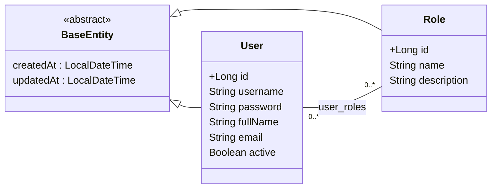

# api-users

# API Users Management

Professional REST API for **user and role management**.
This project demonstrates expertise in **Spring Boot**, clean design, and production-ready code quality.



---
### Directive


---

## 🚀 Key Features

* RESTful API built with **Spring Boot 4** and **Java 21**
* Layered architecture (Controller, Service, Repository)
* Full CRUD operations for **Users** and **Roles**
* **Standardized pagination** and consistent API responses
* Robust data validation with **Jakarta Bean Validation**
* Efficient and type-safe mapping between entities and DTOs using **MapStruct**
* **JPA projections** for optimized queries
* Bulk import of roles from **CSV files**
* Interactive API documentation via **Swagger / OpenAPI**
* **Unit testing** with JUnit and Mockito
* Code quality control with **JaCoCo** (minimum coverage threshold 75%)
* Ready-to-use configuration for **PostgreSQL** and **H2** (for testing)
* Clean, maintainable code with **Lombok**

---

## 🧼 Technologies Used

* Java 21
* Spring Boot 4
* Spring Web / Spring Data JPA
* Hibernate
* PostgreSQL / H2
* MapStruct
* Lombok
* Swagger / OpenAPI
* JUnit 5 / Mockito
* JaCoCo
* Maven

---

## 📌 Highlighted Endpoints

### Users

* Create, update, delete, and retrieve users
* Paginated listing
* Optimized active users query via projections

### Roles

* Full CRUD operations for roles
* Paginated listing
* Import roles from CSV

---

# Swagger Documentation

Professional backend project for **user and role management** built with **Spring Boot 4** and **Java 21**.

[📄 Swagger Documentation](http://localhost:8080/swagger-ui/index.html)

## 🚀 Main Endpoints

### Roles (`/roles`)

* `GET /roles/{id}` - Get role by ID
* `GET /roles/page` - Paginated list
* `POST /roles` - Create role
* `PUT /roles/{id}` - Update role
* `DELETE /roles/delete/{id}` - Delete role
* `POST /roles/import` - Import roles from CSV

### Users (`/users`)

* `GET /users/{id}` - Get user by ID
* `GET /users/page` - Paginated list
* `GET /users/active-true` - List active users
* `POST /users` - Create user
* `PUT /users/{id}` - Update user
* `DELETE /users/{id}` - Delete user

### Run
```bash
git clone <repo-url>
cd api-users
mvn clean install
mvn spring-boot:run
```

---

* Standardized responses using `GenericResponse<T>` and paginated results with `PageResponse<T>`
* Data validation with **Jakarta Bean Validation**
* Clean, scalable code ready for production, extensible to JWT security or microservices
